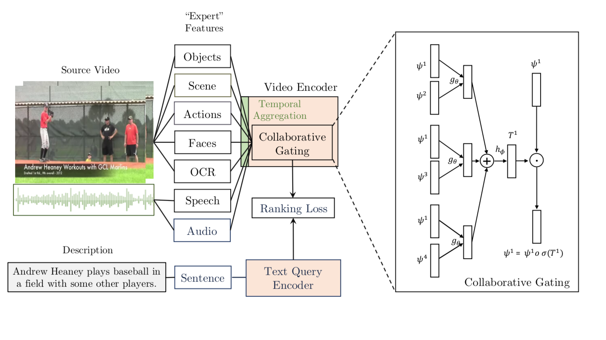

## Collaborative Experts

This repo provides code for learning and evaluating joint video-text embeddings for the task of video retrieval.  Our approach is described in the [collaborative experts paper](link).  



In brief, the *Collaborative Experts* framework aims to achieve robustness through two mechanisms:
1. Extracting information from a wide range of modalities, including those that are typically always available in video (such as RGB) as well as more "specific" clues which may only occasionally be present (such as overlaid text).
2. A module that aims to combine these modalities into a fixed size representation that in a manner that is robust to noise.


**Requirements:** The code assumes PyTorch 1.1 and Python 3.7 (other versions may work, but have not been tested).

### Evaluating pretrained video embeddings

We provide pretrained models for each dataset to reproduce the results reported in the paper.  Each model is accompanied by training and evaluation logs.  Performance is evalauted for retrieval in both directions:
* `t2v` denotes that a text query is used to retrieve videos
* `v2t` denotes that a video query is used to retrieve text video descriptions

Joint-embeddings can be used for either of these two tasks. In the results reported below, the same model is used for both the t2v and v2t evaluations.  Each metric is reported as the mean and standard deviation (in parentheses) across three training runs.

**Reference results:** The results below are close to those in the paper for MSRVTT, LSMDC, MSRVTT (the mean performance should vary by at most +/- 0.6 across different metrics from those reported).  The performance for ActivityNet and DiDeMo has improved, in some cases quite significantly, after removing some bugs in the training code.


**MSRVTT Benchmark**


| Model | Split | Task | R@1 | R@5 | R@10 | R@50 | MdR | MnR | Links |
| ----- | ------| ---- | --- | --- | ---- | ---- | --- | --- | ----- |
| CE    | Full  | t2v  | 22.5<sub>(0.1)</sub> | 52.1<sub>(0.2)</sub> | 65.5<sub>(0.1)</sub> | 89.4<sub>(0.1)</sub> | 5.0<sub>(0.0)</sub> | 22.5<sub>(0.1)</sub> | [config](http:/www.robots.ox.ac.uk/~vgg/research/collaborative-experts/data/models/msrvtt-train-full-ce/07-25_17-19-34/config.json), [model](http:/www.robots.ox.ac.uk/~vgg/research/collaborative-experts/data/models/msrvtt-train-full-ce/07-25_17-19-34/trained_model.pth), [log](http:/www.robots.ox.ac.uk/~vgg/research/collaborative-experts/data/log/msrvtt-train-full-ce/07-25_17-19-34/info.log) |
| CE    | 1k-A  | t2v  | 39.4<sub>(0.6)</sub> | 75.2<sub>(0.6)</sub> | 85.1<sub>(0.4)</sub> | 97.1<sub>(0.1)</sub> | 2.0<sub>(0.0)</sub> | 7.5<sub>(0.2)</sub> | [config](http:/www.robots.ox.ac.uk/~vgg/research/collaborative-experts/data/models/msrvtt-train-jsfusion-ce/2019-07-26_15-18-46/config.json), [model](http:/www.robots.ox.ac.uk/~vgg/research/collaborative-experts/data/models/msrvtt-train-jsfusion-ce/2019-07-26_15-18-46/trained_model.pth), [log](http:/www.robots.ox.ac.uk/~vgg/research/collaborative-experts/data/log/msrvtt-train-jsfusion-ce/2019-07-26_15-18-46/info.log) |
| CE    | 1k-B  | t2v  | 32.2<sub>(1.2)</sub> | 64.7<sub>(0.4)</sub> | 75.8<sub>(0.1)</sub> | 94.5<sub>(0.4)</sub> | 3.0<sub>(0.0)</sub> | 12.3<sub>(0.1)</sub> | [config](http:/www.robots.ox.ac.uk/~vgg/research/collaborative-experts/data/models/msrvtt-train-miech-ce/2019-07-26_15-04-54/config.json), [model](http:/www.robots.ox.ac.uk/~vgg/research/collaborative-experts/data/models/msrvtt-train-miech-ce/2019-07-26_15-04-54/trained_model.pth), [log](http:/www.robots.ox.ac.uk/~vgg/research/collaborative-experts/data/log/msrvtt-train-miech-ce/2019-07-26_15-04-54/info.log) |
| MoEE* | 1k-B  | t2v  | 15.9<sub>(0.3)</sub> | 40.8<sub>(0.8)</sub> | 56.3<sub>(0.2)</sub> | 85.6<sub>(0.5)</sub> | 8.0<sub>(0.0)</sub> | 32.8<sub>(0.4)</sub> | [config](http:/www.robots.ox.ac.uk/~vgg/research/collaborative-experts/data/models/msrvtt-train-miech-miechfeats-moee/2019-07-26_15-16-18/config.json), [model](http:/www.robots.ox.ac.uk/~vgg/research/collaborative-experts/data/models/msrvtt-train-miech-miechfeats-moee/2019-07-26_15-16-18/trained_model.pth), [log](http:/www.robots.ox.ac.uk/~vgg/research/collaborative-experts/data/log/msrvtt-train-miech-miechfeats-moee/2019-07-26_15-16-18/info.log) |
| CE    | Full  | v2t  | 34.4<sub>(0.4)</sub> | 64.6<sub>(0.3)</sub> | 77.0<sub>(0.4)</sub> | 94.7<sub>(0.1)</sub> | 3.0<sub>(0.0)</sub> | 13.2<sub>(0.6)</sub> | [config](http:/www.robots.ox.ac.uk/~vgg/research/collaborative-experts/data/models/msrvtt-train-full-ce/07-25_17-19-34/config.json), [model](http:/www.robots.ox.ac.uk/~vgg/research/collaborative-experts/data/models/msrvtt-train-full-ce/07-25_17-19-34/trained_model.pth), [log](http:/www.robots.ox.ac.uk/~vgg/research/collaborative-experts/data/log/msrvtt-train-full-ce/07-25_17-19-34/info.log) |
| CE    | 1k-A  | v2t  | 40.5<sub>(0.7)</sub> | 74.8<sub>(0.4)</sub> | 85.7<sub>(0.9)</sub> | 97.2<sub>(0.5)</sub> | 2.0<sub>(0.0)</sub> | 7.4<sub>(0.2)</sub> | [config](http:/www.robots.ox.ac.uk/~vgg/research/collaborative-experts/data/models/msrvtt-train-jsfusion-ce/2019-07-26_15-18-46/config.json), [model](http:/www.robots.ox.ac.uk/~vgg/research/collaborative-experts/data/models/msrvtt-train-jsfusion-ce/2019-07-26_15-18-46/trained_model.pth), [log](http:/www.robots.ox.ac.uk/~vgg/research/collaborative-experts/data/log/msrvtt-train-jsfusion-ce/2019-07-26_15-18-46/info.log) |
| CE    | 1k-B  | v2t  | 31.5<sub>(0.7)</sub> | 66.0<sub>(0.7)</sub> | 77.5<sub>(0.7)</sub> | 95.0<sub>(0.3)</sub> | 3.0<sub>(0.0)</sub> | 11.4<sub>(0.2)</sub> | [config](http:/www.robots.ox.ac.uk/~vgg/research/collaborative-experts/data/models/msrvtt-train-miech-ce/2019-07-26_15-04-54/config.json), [model](http:/www.robots.ox.ac.uk/~vgg/research/collaborative-experts/data/models/msrvtt-train-miech-ce/2019-07-26_15-04-54/trained_model.pth), [log](http:/www.robots.ox.ac.uk/~vgg/research/collaborative-experts/data/log/msrvtt-train-miech-ce/2019-07-26_15-04-54/info.log) |
| MoEE* | 1k-B  | v2t  | 17.7<sub>(0.3)</sub> | 45.9<sub>(0.3)</sub> | 59.4<sub>(0.2)</sub> | 87.2<sub>(0.8)</sub> | 6.7<sub>(0.6)</sub> | 28.7<sub>(0.4)</sub> | [config](http:/www.robots.ox.ac.uk/~vgg/research/collaborative-experts/data/models/msrvtt-train-miech-miechfeats-moee/2019-07-26_15-16-18/config.json), [model](http:/www.robots.ox.ac.uk/~vgg/research/collaborative-experts/data/models/msrvtt-train-miech-miechfeats-moee/2019-07-26_15-16-18/trained_model.pth), [log](http:/www.robots.ox.ac.uk/~vgg/research/collaborative-experts/data/log/msrvtt-train-miech-miechfeats-moee/2019-07-26_15-16-18/info.log) |

Models marked with * use the features made available with the work of [Miech et al.](https://arxiv.org/abs/1804.02516) (without OCR, speech and scene features), unstarred models on the `1k-B` and `Full` splits make use of OCR, speech and scene features, as well slightly stronger text encodings (GPT, rather than word2vec - see the paper for details). The MoEE model is included as a sanity check that our codebase approximately reproduces the MoEE paper.


See the [MSRVTT README](misc/datasets/msrvtt/README.md) for links to the train/val/test lists of each split.

**LSMDC Benchmark**

| Model | Task | R@1 | R@5 | R@10 | R@50 | MdR | MnR | Links |
| ------| ------| ---:| ---:| ----:| ----:|----:|----:|------:|
| CE | t2v  | 12.6<sub>(0.8)</sub> | 31.0<sub>(0.6)</sub> | 40.3<sub>(0.5)</sub> | 68.1<sub>(1.0)</sub> | 19.0<sub>(0.0)</sub> | 65.7<sub>(0.8)</sub> | [config](http:/www.robots.ox.ac.uk/~vgg/research/collaborative-experts/data/models/lsmdc-train-full-ce/07-25_17-19-51/config.json), [model](http:/www.robots.ox.ac.uk/~vgg/research/collaborative-experts/data/models/lsmdc-train-full-ce/07-25_17-19-51/trained_model.pth), [log](http:/www.robots.ox.ac.uk/~vgg/research/collaborative-experts/data/log/lsmdc-train-full-ce/07-25_17-19-51/info.log) |
| CE | v2t  | 13.5<sub>(1.1)</sub> | 30.8<sub>(0.7)</sub> | 41.0<sub>(0.6)</sub> | 67.1<sub>(1.1)</sub> | 18.7<sub>(0.6)</sub> | 66.2<sub>(0.9)</sub> | [config](http:/www.robots.ox.ac.uk/~vgg/research/collaborative-experts/data/models/lsmdc-train-full-ce/07-25_17-19-51/config.json), [model](http:/www.robots.ox.ac.uk/~vgg/research/collaborative-experts/data/models/lsmdc-train-full-ce/07-25_17-19-51/trained_model.pth), [log](http:/www.robots.ox.ac.uk/~vgg/research/collaborative-experts/data/log/lsmdc-train-full-ce/07-25_17-19-51/info.log) |

See the [LSMDC README](misc/datasets/lsmdc/README.md) for descriptions of the train/test splits.

**MSVD Benchmark**

| Model | Task | R@1 | R@5 | R@10 | R@50 | MdR | MnR | Links |
| ------| ------| ---:| ---:| ----:| ----:|----:|----:|------:|
| CE | t2v  | 20.9<sub>(0.5)</sub> | 49.7<sub>(0.4)</sub> | 63.8<sub>(0.4)</sub> | 90.0<sub>(0.4)</sub> | 5.7<sub>(0.6)</sub> | 19.5<sub>(0.9)</sub> | [config](http:/www.robots.ox.ac.uk/~vgg/research/collaborative-experts/data/models/msvd-train-full-ce/07-25_15-18-17/config.json), [model](http:/www.robots.ox.ac.uk/~vgg/research/collaborative-experts/data/models/msvd-train-full-ce/07-25_15-18-17/trained_model.pth), [log](http:/www.robots.ox.ac.uk/~vgg/research/collaborative-experts/data/log/msvd-train-full-ce/07-25_15-18-17/info.log) |
| CE | v2t  | 25.7<sub>(0.7)</sub> | 47.6<sub>(1.1)</sub> | 57.6<sub>(1.0)</sub> | 79.4<sub>(0.1)</sub> | 6.7<sub>(0.6)</sub> | 46.1<sub>(4.7)</sub> | [config](http:/www.robots.ox.ac.uk/~vgg/research/collaborative-experts/data/models/msvd-train-full-ce/07-25_15-18-17/config.json), [model](http:/www.robots.ox.ac.uk/~vgg/research/collaborative-experts/data/models/msvd-train-full-ce/07-25_15-18-17/trained_model.pth), [log](http:/www.robots.ox.ac.uk/~vgg/research/collaborative-experts/data/log/msvd-train-full-ce/07-25_15-18-17/info.log) |

See the [MSVD README](misc/datasets/msvd/README.md) for descriptions of the train/test splits. Note that the videos in the MSVD dataset do not have soundtracks.

**DiDeMo Benchmark**

| Model | Split | R@1 | R@5 | R@10 | R@50 | MdR | MnR | Links |
| ------| ------| ---:| ---:| ----:| ----:|----:|----:|------:|
| CE | Full  | 22.6<sub>(0.5)</sub> | 51.1<sub>(1.0)</sub> | 63.6<sub>(1.2)</sub> | 87.3<sub>(0.3)</sub> | 5.0<sub>(0.0)</sub> | 27.4<sub>(1.1)</sub> | [config](http:/www.robots.ox.ac.uk/~vgg/research/collaborative-experts/data/models/didemo-train-full-ce/2019-07-26_15-12-44/config.json), [model](http:/www.robots.ox.ac.uk/~vgg/research/collaborative-experts/data/models/didemo-train-full-ce/2019-07-26_15-12-44/trained_model.pth), [log](http:/www.robots.ox.ac.uk/~vgg/research/collaborative-experts/data/log/didemo-train-full-ce/2019-07-26_15-12-44/info.log) |

**ActivityNet Benchmark**

| Model | Split | R@1 | R@5 | R@10 | R@50 | MdR | MnR | Links |
| ------| ------| ---:| ---:| ----:| ----:|----:|----:|------:|
| CE | Full  | 27.3<sub>(0.7)</sub> | 61.1<sub>(1.0)</sub> | 75.4<sub>(0.8)</sub> | 94.4<sub>(0.1)</sub> | 4.0<sub>(0.0)</sub> | 15.4<sub>(0.9)</sub> | [config](http:/www.robots.ox.ac.uk/~vgg/research/collaborative-experts/data/models/activity-net-train-full-ce/07-25_17-19-48/config.json), [model](http:/www.robots.ox.ac.uk/~vgg/research/collaborative-experts/data/models/activity-net-train-full-ce/07-25_17-19-48/trained_model.pth), [log](http:/www.robots.ox.ac.uk/~vgg/research/collaborative-experts/data/log/activity-net-train-full-ce/07-25_17-19-48/info.log) |


### Training a video embedding

To train a new video embedding, please see the scripts for each dataset.

### Expert Zoo

For each dataset, the Collaborative Experts model makes use of a collection of pretrained "expert" feature extractors (see the paper for more precise descriptions). Some experts have been obtained from other sources (described where applicable), rather than extracted by us.  To reproduce the experiments listed above, the experts for each dataset have been bundled into compressed tar files.  These can be downloaded and unpacked with a [utility script-TODO-LINK]() (recommended), which will store them in the locations expected by the training code. Each set of experts has a brief README, which also provides a link from which they can be downloaded directly.

  | Dataset           | Experts  |  Details and links | Archive size |
 |:-------------:|:-----:|:----:|:---:|
| MSRVTT | audio, face, flow, ocr, rgb, scene, speech | [README](misc/datasets/msrvtt/README.md)| 19.6 GiB
| LSMDC | audio, face, flow, ocr, rgb, scene | [README](misc/datasets/lsmdc/README.md)| 6.1 GiB
| MSVD | face, flow, ocr, rgb, scene | [README](misc/datasets/lsmdc/README.md)| 6.1 GiB

### Visualising the retrieval ranking

Tensorboard lacks video support via HTML5 tags (at the time of writing) so after each evaluation of a retrieval model, a simple HTML file is generated to allow the predicted rankings of different videos to be visualised: an example screenshot is given below (this tool is inspired by the visualiser in the [pix2pix codebase](https://github.com/junyanz/pytorch-CycleGAN-and-pix2pix)). To view the visualisation, navigate to the `vis_dir` specified in the relevant config file (e.g. [here]()) and run `python3 -m http.server 9999`, then navigate to `localhost:9999` in your web browser.  You should see something like the following:


### References

If you find this code useful or use the extracted features, please consider citing:

```
@inproceedings{Liu2019a,
  author    = {Liu, Y. and Albanie, S. and Nagrani, A. and Zisserman, A.},
  booktitle = {British Machine Vision Conference},
  title     = {Use What You Have: Video retrieval using representations from collaborative experts},
  date      = {2019},
}
```

If you make use of the MSRVTT or LSMDC features provided by Miech et al. (details are given in their respective READMEs [here](misc/datasets/msrvtt/README.md) and [here](misc/datasets/lsmdc/README.md)), please cite:

```
@article{miech2018learning,
  title={Learning a text-video embedding from incomplete and heterogeneous data},
  author={Miech, Antoine and Laptev, Ivan and Sivic, Josef},
  journal={arXiv preprint arXiv:1804.02516},
  year={2018}
}
```


### Acknowledgements

This work was inspired by the *Mixture-of-Embedding-Experts* method proposed by Antoine Miech, Ivan Laptev and Josef Sivic ([paper](https://arxiv.org/abs/1804.02516), [code](https://github.com/antoine77340/Mixture-of-Embedding-Experts)). We would also like to thank Zak Stone and Susie Lim for their considerable help with using Cloud TPUs.