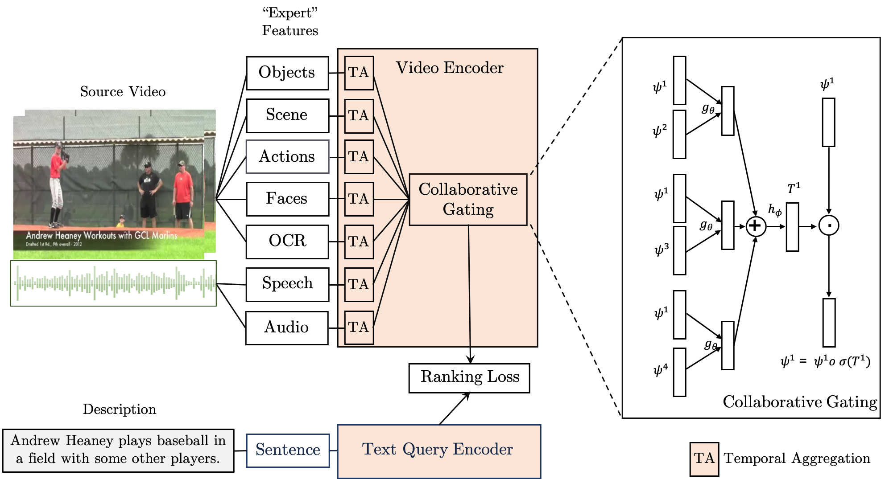

This repo provides code for learning and evaluating joint video-text embeddings for the task of video retrieval.  Our approach is described in the BMVC 2019 paper "Use What You Have: Video retrieval using representations from collaborative experts" ([paper](https://arxiv.org/abs/1907.13487), [project page](https://www.robots.ox.ac.uk/~vgg/research/collaborative-experts/)).





**High-level Overview**: The *Collaborative Experts* framework aims to achieve robustness through two mechanisms:
1. The use of information from a wide range of modalities, including those that are typically always available in video (such as RGB) as well as more "specific" clues which may only occasionally be present (such as overlaid text).
2. A module that aims to combine these modalities into a fixed size representation that in a manner that is robust to noise.

[](https://paperswithcode.com/sota/video-retrieval-on-lsmdc?p=use-what-you-have-video-retrieval-using) 
[](https://paperswithcode.com/sota/video-retrieval-on-activitynet?p=use-what-you-have-video-retrieval-using) 
[](https://paperswithcode.com/sota/video-retrieval-on-didemo?p=use-what-you-have-video-retrieval-using)
[](https://paperswithcode.com/sota/video-retrieval-on-msvd?p=use-what-you-have-video-retrieval-using)
[](https://paperswithcode.com/sota/video-retrieval-on-msr-vtt?p=use-what-you-have-video-retrieval-using)


**Requirements:** The code assumes PyTorch 1.1 and Python 3.7 (other versions may work, but have not been tested).  See the section on dependencies towards the end of this file for specific package requirements.


### Pretrained video embeddings

We provide pretrained models for each dataset to reproduce the results reported in the paper [1] (references follow at the end of this README).  Each model is accompanied by training and evaluation logs.  Performance is evalauted for retrieval in both directions (joint-embeddings can be used for either of these two tasks):
* `t2v` denotes that a text query is used to retrieve videos
* `v2t` denotes that a video query is used to retrieve text video descriptions

In the results reported below, the same model is used for both the t2v and v2t evaluations.  Each metric is reported as the mean and standard deviation (in parentheses) across three training runs.


**MSRVTT Benchmark**


| Model | Split | Task | R@1 | R@5 | R@10 | R@50 | MdR | MnR | Links |
| ----- | ------| ---- | --- | --- | ---- | ---- | --- | --- | ----- |
| CE    | Full  | t2v  | 22.5<sub>(0.1)</sub> | 52.1<sub>(0.2)</sub> | 65.5<sub>(0.1)</sub> | 89.4<sub>(0.1)</sub> | 5.0<sub>(0.0)</sub> | 22.5<sub>(0.1)</sub> | [config](http:/www.robots.ox.ac.uk/~vgg/research/collaborative-experts/data/models/msrvtt-train-full-ce/07-25_17-19-34/config.json), [model](http:/www.robots.ox.ac.uk/~vgg/research/collaborative-experts/data/models/msrvtt-train-full-ce/07-25_17-19-34/trained_model.pth), [log](http:/www.robots.ox.ac.uk/~vgg/research/collaborative-experts/data/log/msrvtt-train-full-ce/07-25_17-19-34/info.log) |
| CE    | 1k-A  | t2v  | 39.4<sub>(0.6)</sub> | 75.2<sub>(0.6)</sub> | 85.1<sub>(0.4)</sub> | 97.1<sub>(0.1)</sub> | 2.0<sub>(0.0)</sub> | 7.5<sub>(0.2)</sub> | [config](http:/www.robots.ox.ac.uk/~vgg/research/collaborative-experts/data/models/msrvtt-train-jsfusion-ce/2019-07-26_15-18-46/config.json), [model](http:/www.robots.ox.ac.uk/~vgg/research/collaborative-experts/data/models/msrvtt-train-jsfusion-ce/2019-07-26_15-18-46/trained_model.pth), [log](http:/www.robots.ox.ac.uk/~vgg/research/collaborative-experts/data/log/msrvtt-train-jsfusion-ce/2019-07-26_15-18-46/info.log) |
| CE    | 1k-B  | t2v  | 32.2<sub>(1.2)</sub> | 64.7<sub>(0.4)</sub> | 75.8<sub>(0.1)</sub> | 94.5<sub>(0.4)</sub> | 3.0<sub>(0.0)</sub> | 12.3<sub>(0.1)</sub> | [config](http:/www.robots.ox.ac.uk/~vgg/research/collaborative-experts/data/models/msrvtt-train-miech-ce/2019-07-26_15-04-54/config.json), [model](http:/www.robots.ox.ac.uk/~vgg/research/collaborative-experts/data/models/msrvtt-train-miech-ce/2019-07-26_15-04-54/trained_model.pth), [log](http:/www.robots.ox.ac.uk/~vgg/research/collaborative-experts/data/log/msrvtt-train-miech-ce/2019-07-26_15-04-54/info.log) |
| MoEE* | 1k-B  | t2v  | 15.9<sub>(0.3)</sub> | 40.8<sub>(0.8)</sub> | 56.3<sub>(0.2)</sub> | 85.6<sub>(0.5)</sub> | 8.0<sub>(0.0)</sub> | 32.8<sub>(0.4)</sub> | [config](http:/www.robots.ox.ac.uk/~vgg/research/collaborative-experts/data/models/msrvtt-train-miech-miechfeats-moee/2019-07-26_15-16-18/config.json), [model](http:/www.robots.ox.ac.uk/~vgg/research/collaborative-experts/data/models/msrvtt-train-miech-miechfeats-moee/2019-07-26_15-16-18/trained_model.pth), [log](http:/www.robots.ox.ac.uk/~vgg/research/collaborative-experts/data/log/msrvtt-train-miech-miechfeats-moee/2019-07-26_15-16-18/info.log) |
| CE    | Full  | v2t  | 34.4<sub>(0.4)</sub> | 64.6<sub>(0.3)</sub> | 77.0<sub>(0.4)</sub> | 94.7<sub>(0.1)</sub> | 3.0<sub>(0.0)</sub> | 13.2<sub>(0.6)</sub> | [config](http:/www.robots.ox.ac.uk/~vgg/research/collaborative-experts/data/models/msrvtt-train-full-ce/07-25_17-19-34/config.json), [model](http:/www.robots.ox.ac.uk/~vgg/research/collaborative-experts/data/models/msrvtt-train-full-ce/07-25_17-19-34/trained_model.pth), [log](http:/www.robots.ox.ac.uk/~vgg/research/collaborative-experts/data/log/msrvtt-train-full-ce/07-25_17-19-34/info.log) |
| CE    | 1k-A  | v2t  | 40.5<sub>(0.7)</sub> | 74.8<sub>(0.4)</sub> | 85.7<sub>(0.9)</sub> | 97.2<sub>(0.5)</sub> | 2.0<sub>(0.0)</sub> | 7.4<sub>(0.2)</sub> | [config](http:/www.robots.ox.ac.uk/~vgg/research/collaborative-experts/data/models/msrvtt-train-jsfusion-ce/2019-07-26_15-18-46/config.json), [model](http:/www.robots.ox.ac.uk/~vgg/research/collaborative-experts/data/models/msrvtt-train-jsfusion-ce/2019-07-26_15-18-46/trained_model.pth), [log](http:/www.robots.ox.ac.uk/~vgg/research/collaborative-experts/data/log/msrvtt-train-jsfusion-ce/2019-07-26_15-18-46/info.log) |
| CE    | 1k-B  | v2t  | 31.5<sub>(0.7)</sub> | 66.0<sub>(0.7)</sub> | 77.5<sub>(0.7)</sub> | 95.0<sub>(0.3)</sub> | 3.0<sub>(0.0)</sub> | 11.4<sub>(0.2)</sub> | [config](http:/www.robots.ox.ac.uk/~vgg/research/collaborative-experts/data/models/msrvtt-train-miech-ce/2019-07-26_15-04-54/config.json), [model](http:/www.robots.ox.ac.uk/~vgg/research/collaborative-experts/data/models/msrvtt-train-miech-ce/2019-07-26_15-04-54/trained_model.pth), [log](http:/www.robots.ox.ac.uk/~vgg/research/collaborative-experts/data/log/msrvtt-train-miech-ce/2019-07-26_15-04-54/info.log) |
| MoEE* | 1k-B  | v2t  | 17.7<sub>(0.3)</sub> | 45.9<sub>(0.3)</sub> | 59.4<sub>(0.2)</sub> | 87.2<sub>(0.8)</sub> | 6.7<sub>(0.6)</sub> | 28.7<sub>(0.4)</sub> | [config](http:/www.robots.ox.ac.uk/~vgg/research/collaborative-experts/data/models/msrvtt-train-miech-miechfeats-moee/2019-07-26_15-16-18/config.json), [model](http:/www.robots.ox.ac.uk/~vgg/research/collaborative-experts/data/models/msrvtt-train-miech-miechfeats-moee/2019-07-26_15-16-18/trained_model.pth), [log](http:/www.robots.ox.ac.uk/~vgg/research/collaborative-experts/data/log/msrvtt-train-miech-miechfeats-moee/2019-07-26_15-16-18/info.log) |

Models marked with * use the features made available with the MoEE model of [2] (without OCR, speech and scene features), unstarred models on the `1k-B` and `Full` splits make use of OCR, speech and scene features, as well slightly stronger text encodings (GPT, rather than word2vec - see [1] for details). The MoEE model is implemented as a sanity check that our codebase approximately reproduces [2] (the [MoEE paper](https://arxiv.org/abs/1804.02516)).


See the [MSRVTT README](misc/datasets/msrvtt/README.md) for links to the train/val/test lists of each split.

**LSMDC Benchmark**

| Model | Task | R@1 | R@5 | R@10 | R@50 | MdR | MnR | Links |
| ------| ------| ---:| ---:| ----:| ----:|----:|----:|------:|
| CE | t2v  | 12.6<sub>(0.8)</sub> | 31.0<sub>(0.6)</sub> | 40.3<sub>(0.5)</sub> | 68.1<sub>(1.0)</sub> | 19.0<sub>(0.0)</sub> | 65.7<sub>(0.8)</sub> | [config](http:/www.robots.ox.ac.uk/~vgg/research/collaborative-experts/data/models/lsmdc-train-full-ce/07-25_17-19-51/config.json), [model](http:/www.robots.ox.ac.uk/~vgg/research/collaborative-experts/data/models/lsmdc-train-full-ce/07-25_17-19-51/trained_model.pth), [log](http:/www.robots.ox.ac.uk/~vgg/research/collaborative-experts/data/log/lsmdc-train-full-ce/07-25_17-19-51/info.log) |
| CE | v2t  | 13.5<sub>(1.1)</sub> | 30.8<sub>(0.7)</sub> | 41.0<sub>(0.6)</sub> | 67.1<sub>(1.1)</sub> | 18.7<sub>(0.6)</sub> | 66.2<sub>(0.9)</sub> | [config](http:/www.robots.ox.ac.uk/~vgg/research/collaborative-experts/data/models/lsmdc-train-full-ce/07-25_17-19-51/config.json), [model](http:/www.robots.ox.ac.uk/~vgg/research/collaborative-experts/data/models/lsmdc-train-full-ce/07-25_17-19-51/trained_model.pth), [log](http:/www.robots.ox.ac.uk/~vgg/research/collaborative-experts/data/log/lsmdc-train-full-ce/07-25_17-19-51/info.log) |

See the [LSMDC README](misc/datasets/lsmdc/README.md) for descriptions of the train/test splits.

**MSVD Benchmark**

| Model | Task | R@1 | R@5 | R@10 | R@50 | MdR | MnR | Links |
| ------| ------| ---:| ---:| ----:| ----:|----:|----:|------:|
| CE | t2v  | 20.9<sub>(0.5)</sub> | 49.7<sub>(0.4)</sub> | 63.8<sub>(0.4)</sub> | 90.0<sub>(0.4)</sub> | 5.7<sub>(0.6)</sub> | 19.5<sub>(0.9)</sub> | [config](http:/www.robots.ox.ac.uk/~vgg/research/collaborative-experts/data/models/msvd-train-full-ce/07-25_15-18-17/config.json), [model](http:/www.robots.ox.ac.uk/~vgg/research/collaborative-experts/data/models/msvd-train-full-ce/07-25_15-18-17/trained_model.pth), [log](http:/www.robots.ox.ac.uk/~vgg/research/collaborative-experts/data/log/msvd-train-full-ce/07-25_15-18-17/info.log) |
| CE | v2t  | 25.7<sub>(0.7)</sub> | 47.6<sub>(1.1)</sub> | 57.6<sub>(1.0)</sub> | 79.4<sub>(0.1)</sub> | 6.7<sub>(0.6)</sub> | 46.1<sub>(4.7)</sub> | [config](http:/www.robots.ox.ac.uk/~vgg/research/collaborative-experts/data/models/msvd-train-full-ce/07-25_15-18-17/config.json), [model](http:/www.robots.ox.ac.uk/~vgg/research/collaborative-experts/data/models/msvd-train-full-ce/07-25_15-18-17/trained_model.pth), [log](http:/www.robots.ox.ac.uk/~vgg/research/collaborative-experts/data/log/msvd-train-full-ce/07-25_15-18-17/info.log) |

See the [MSVD README](misc/datasets/msvd/README.md) for descriptions of the train/test splits. Note that the videos in the MSVD dataset do not have soundtracks.

**DiDeMo Benchmark**

| Model | Task | R@1 | R@5 | R@10 | R@50 | MdR | MnR | Links |
| ------| ------| ---:| ---:| ----:| ----:|----:|----:|------:|
| CE | t2v  | 22.6<sub>(0.5)</sub> | 51.1<sub>(1.0)</sub> | 63.6<sub>(1.2)</sub> | 87.3<sub>(0.3)</sub> | 5.0<sub>(0.0)</sub> | 27.4<sub>(1.1)</sub> | [config](http:/www.robots.ox.ac.uk/~vgg/research/collaborative-experts/data/models/didemo-train-full-ce/2019-07-26_15-12-44/config.json), [model](http:/www.robots.ox.ac.uk/~vgg/research/collaborative-experts/data/models/didemo-train-full-ce/2019-07-26_15-12-44/trained_model.pth), [log](http:/www.robots.ox.ac.uk/~vgg/research/collaborative-experts/data/log/didemo-train-full-ce/2019-07-26_15-12-44/info.log) |
| CE | v2t  | 22.5<sub>(1.3)</sub> | 52.3<sub>(0.8)</sub> | 65.7<sub>(0.8)</sub> | 89.2<sub>(0.8)</sub> | 5.0<sub>(0.0)</sub> | 23.2<sub>(1.1)</sub> | [config](http:/www.robots.ox.ac.uk/~vgg/research/collaborative-experts/data/models/didemo-train-full-ce/2019-07-26_15-12-44/config.json), [model](http:/www.robots.ox.ac.uk/~vgg/research/collaborative-experts/data/models/didemo-train-full-ce/2019-07-26_15-12-44/trained_model.pth), [log](http:/www.robots.ox.ac.uk/~vgg/research/collaborative-experts/data/log/didemo-train-full-ce/2019-07-26_15-12-44/info.log) |

See the [DiDeMo README](misc/datasets/didemo/README.md) for descriptions of the train/val/test splits.

**ActivityNet Benchmark**

| Model | Task | R@1 | R@5 | R@10 | R@50 | MdR | MnR | Links |
| ------| ------| ---:| ---:| ----:| ----:|----:|----:|------:|
| CE | t2v  | 27.3<sub>(0.7)</sub> | 61.1<sub>(1.0)</sub> | 75.4<sub>(0.8)</sub> | 94.4<sub>(0.1)</sub> | 4.0<sub>(0.0)</sub> | 15.4<sub>(0.9)</sub> | [config](http:/www.robots.ox.ac.uk/~vgg/research/collaborative-experts/data/models/activity-net-train-full-ce/07-25_17-19-48/config.json), [model](http:/www.robots.ox.ac.uk/~vgg/research/collaborative-experts/data/models/activity-net-train-full-ce/07-25_17-19-48/trained_model.pth), [log](http:/www.robots.ox.ac.uk/~vgg/research/collaborative-experts/data/log/activity-net-train-full-ce/07-25_17-19-48/info.log) |
| CE | v2t  | 27.9<sub>(0.6)</sub> | 61.6<sub>(0.4)</sub> | 76.2<sub>(0.2)</sub> | 95.0<sub>(0.2)</sub> | 3.3<sub>(0.6)</sub> | 14.5<sub>(0.8)</sub> | [config](http:/www.robots.ox.ac.uk/~vgg/research/collaborative-experts/data/models/activity-net-train-full-ce/07-25_17-19-48/config.json), [model](http:/www.robots.ox.ac.uk/~vgg/research/collaborative-experts/data/models/activity-net-train-full-ce/07-25_17-19-48/trained_model.pth), [log](http:/www.robots.ox.ac.uk/~vgg/research/collaborative-experts/data/log/activity-net-train-full-ce/07-25_17-19-48/info.log) |

See the [ActivityNet README](misc/datasets/activity-net/README.md) for descriptions of the train/test splits.


### Ablation studies

We conduct several ablation studies to investigate the importance of different components in the Collaborative Experts design.  Each ablation is conducted on the `Full` MSRVTT split. 

**CE Design**: First, we investigate the importance of the parts used by the CE model.

| Model | Task | R@1 | R@5 | R@10 | MdR | Params | Links |
| ---   | :--: | :-: | :-: | :--: | :-: | :----: | :---: |
| Concat | t2v  | 0.5<sub>(0.1)</sub> | 2.4<sub>(0.2)</sub> | 4.5<sub>(0.3)</sub> | 253.3<sub>(5.7)</sub> | 318.16k | [config](http:/www.robots.ox.ac.uk/~vgg/research/collaborative-experts/data/models/msrvtt-train-full-concat-ablation/2019-07-28_16-10-22/config.json), [model](http:/www.robots.ox.ac.uk/~vgg/research/collaborative-experts/data/models/msrvtt-train-full-concat-ablation/2019-07-28_16-10-22/trained_model.pth), [log](http:/www.robots.ox.ac.uk/~vgg/research/collaborative-experts/data/log/msrvtt-train-full-concat-ablation/2019-07-28_16-10-22/info.log) |
| Concat + G | t2v  | 6.8<sub>(0.1)</sub> | 20.4<sub>(0.1)</sub> | 30.1<sub>(0.3)</sub> | 32.0<sub>(0.0)</sub> | 295.84M | [config](http:/www.robots.ox.ac.uk/~vgg/research/collaborative-experts/data/models/msrvtt-train-full-concat-mix-ablation/2019-07-28_14-22-10/config.json), [model](http:/www.robots.ox.ac.uk/~vgg/research/collaborative-experts/data/models/msrvtt-train-full-concat-mix-ablation/2019-07-28_14-22-10/trained_model.pth), [log](http:/www.robots.ox.ac.uk/~vgg/research/collaborative-experts/data/log/msrvtt-train-full-concat-mix-ablation/2019-07-28_14-22-10/info.log) |
| CE - MW,P,CG | t2v  | 13.2<sub>(0.1)</sub> | 36.3<sub>(0.1)</sub> | 49.9<sub>(0.0)</sub> | 11.0<sub>(0.0)</sub> | 143.44M | [config](http:/www.robots.ox.ac.uk/~vgg/research/collaborative-experts/data/models/msrvtt-train-full-moee-minus-moe-weights/2019-07-28_14-20-52/config.json), [model](http:/www.robots.ox.ac.uk/~vgg/research/collaborative-experts/data/models/msrvtt-train-full-moee-minus-moe-weights/2019-07-28_14-20-52/trained_model.pth), [log](http:/www.robots.ox.ac.uk/~vgg/research/collaborative-experts/data/log/msrvtt-train-full-moee-minus-moe-weights/2019-07-28_14-20-52/info.log) |
| CE - P,CG | t2v  | 13.6<sub>(0.0)</sub> | 36.2<sub>(0.0)</sub> | 49.5<sub>(0.1)</sub> | 11.0<sub>(0.0)</sub> | 143.44M | [config](http:/www.robots.ox.ac.uk/~vgg/research/collaborative-experts/data/models/msrvtt-train-full-moee/2019-07-27_11-35-13/config.json), [model](http:/www.robots.ox.ac.uk/~vgg/research/collaborative-experts/data/models/msrvtt-train-full-moee/2019-07-27_11-35-13/trained_model.pth), [log](http:/www.robots.ox.ac.uk/~vgg/research/collaborative-experts/data/log/msrvtt-train-full-moee/2019-07-27_11-35-13/info.log) |
| CE - CG  | t2v  | 13.5<sub>(0.1)</sub> | 36.0<sub>(0.2)</sub> | 49.0<sub>(0.2)</sub> | 11.0<sub>(0.0)</sub> | 105.89M | [config](http:/www.robots.ox.ac.uk/~vgg/research/collaborative-experts/data/models/msrvtt-train-full-ce-ablation-dims/2019-07-30_17-01-27/config.json), [model](http:/www.robots.ox.ac.uk/~vgg/research/collaborative-experts/data/models/msrvtt-train-full-ce-ablation-dims/2019-07-30_17-01-27/trained_model.pth), [log](http:/www.robots.ox.ac.uk/~vgg/research/collaborative-experts/data/log/msrvtt-train-full-ce-ablation-dims/2019-07-30_17-01-27/info.log) |
| CE    | t2v  | 22.5<sub>(0.1)</sub> | 52.1<sub>(0.2)</sub> | 65.5<sub>(0.1)</sub> | 5.0<sub>(0.0)</sub> | 107.74M | [config](http:/www.robots.ox.ac.uk/~vgg/research/collaborative-experts/data/models/msrvtt-train-full-ce/07-25_17-19-34/config.json), [model](http:/www.robots.ox.ac.uk/~vgg/research/collaborative-experts/data/models/msrvtt-train-full-ce/07-25_17-19-34/trained_model.pth), [log](http:/www.robots.ox.ac.uk/~vgg/research/collaborative-experts/data/log/msrvtt-train-full-ce/07-25_17-19-34/info.log) |
| Concat | v2t  | 0.5<sub>(0.2)</sub> | 2.6<sub>(0.4)</sub> | 5.2<sub>(0.6)</sub> | 259.5<sub>(7.3)</sub> | 318.16k | [config](http:/www.robots.ox.ac.uk/~vgg/research/collaborative-experts/data/models/msrvtt-train-full-concat-ablation/2019-07-28_16-10-22/config.json), [model](http:/www.robots.ox.ac.uk/~vgg/research/collaborative-experts/data/models/msrvtt-train-full-concat-ablation/2019-07-28_16-10-22/trained_model.pth), [log](http:/www.robots.ox.ac.uk/~vgg/research/collaborative-experts/data/log/msrvtt-train-full-concat-ablation/2019-07-28_16-10-22/info.log) |
| Concat + G | v2t  | 10.4<sub>(0.6)</sub> | 29.4<sub>(0.2)</sub> | 40.7<sub>(0.5)</sub> | 17.0<sub>(0.0)</sub> | 295.84M | [config](http:/www.robots.ox.ac.uk/~vgg/research/collaborative-experts/data/models/msrvtt-train-full-concat-mix-ablation/2019-07-28_14-22-10/config.json), [model](http:/www.robots.ox.ac.uk/~vgg/research/collaborative-experts/data/models/msrvtt-train-full-concat-mix-ablation/2019-07-28_14-22-10/trained_model.pth), [log](http:/www.robots.ox.ac.uk/~vgg/research/collaborative-experts/data/log/msrvtt-train-full-concat-mix-ablation/2019-07-28_14-22-10/info.log) |
| CE - MW,P,CG | v2t  | 28.9<sub>(0.3)</sub> | 61.7<sub>(0.7)</sub> | 75.6<sub>(0.9)</sub> | 3.2<sub>(0.3)</sub> | 143.44M | [config](http:/www.robots.ox.ac.uk/~vgg/research/collaborative-experts/data/models/msrvtt-train-full-moee-minus-moe-weights/2019-07-28_14-20-52/config.json), [model](http:/www.robots.ox.ac.uk/~vgg/research/collaborative-experts/data/models/msrvtt-train-full-moee-minus-moe-weights/2019-07-28_14-20-52/trained_model.pth), [log](http:/www.robots.ox.ac.uk/~vgg/research/collaborative-experts/data/log/msrvtt-train-full-moee-minus-moe-weights/2019-07-28_14-20-52/info.log) |
| CE - P,CG | v2t  | 33.2<sub>(0.5)</sub> | 63.1<sub>(0.7)</sub> | 75.7<sub>(0.6)</sub> | 3.0<sub>(0.0)</sub> | 143.44M | [config](http:/www.robots.ox.ac.uk/~vgg/research/collaborative-experts/data/models/msrvtt-train-full-moee/2019-07-27_11-35-13/config.json), [model](http:/www.robots.ox.ac.uk/~vgg/research/collaborative-experts/data/models/msrvtt-train-full-moee/2019-07-27_11-35-13/trained_model.pth), [log](http:/www.robots.ox.ac.uk/~vgg/research/collaborative-experts/data/log/msrvtt-train-full-moee/2019-07-27_11-35-13/info.log) |
| CE - CG  | v2t  | 30.3<sub>(0.2)</sub> | 63.1<sub>(0.3)</sub> | 75.5<sub>(0.5)</sub> | 3.0<sub>(0.0)</sub> | 105.89M | [config](http:/www.robots.ox.ac.uk/~vgg/research/collaborative-experts/data/models/msrvtt-train-full-ce-ablation-dims/2019-07-30_17-01-27/config.json), [model](http:/www.robots.ox.ac.uk/~vgg/research/collaborative-experts/data/models/msrvtt-train-full-ce-ablation-dims/2019-07-30_17-01-27/trained_model.pth), [log](http:/www.robots.ox.ac.uk/~vgg/research/collaborative-experts/data/log/msrvtt-train-full-ce-ablation-dims/2019-07-30_17-01-27/info.log) |
| CE    | v2t  | 34.4<sub>(0.4)</sub> | 64.6<sub>(0.3)</sub> | 77.0<sub>(0.4)</sub> | 3.0<sub>(0.0)</sub> | 107.74M | [config](http:/www.robots.ox.ac.uk/~vgg/research/collaborative-experts/data/models/msrvtt-train-full-ce/07-25_17-19-34/config.json), [model](http:/www.robots.ox.ac.uk/~vgg/research/collaborative-experts/data/models/msrvtt-train-full-ce/07-25_17-19-34/trained_model.pth), [log](http:/www.robots.ox.ac.uk/~vgg/research/collaborative-experts/data/log/msrvtt-train-full-ce/07-25_17-19-34/info.log) |

Each row adds an additional component to the model.  The names refer to the following model designs:
* **Concat**: A barebones concatenation model.  After aggregating each expert across time (which still requires some parameters for the variable-length VLAD layers), the experts are concatenated and compared directly against the aggregated text embeddings.  Note: this model uses a slightly greater number of VLAD clusters than the others to allow the concatentated embedding to match the dimensionality of the text.
* **Concat-G**: The experts are concatenated (similarly to the previous model), but are then passed through a single large context gating module before matching against the text embedding.
* **CE - MW,P,CG** - The CE model without MoE weights, projecting to a common dimension or Collaborative Gating.
* **CE - P,CG** - The CE model without projecting to a common dimension or Collaborative Gating (note that this is equivalent to the MoEE model proposed in [2]).
* **CE - CG** - The CE model without Collaborative Gating (CG).
* **CE** - The full CE model.

Note that in the table above some metrics have been removed to allow the number of parameters to be displayed---these additional metrics can be found in the linked logs.

**Importance of Different Experts**: The next ablation investigates the value of each of the different experts towards the final embedding.  Since not all experts are available in every video, we pair each expert with RGB, to give an approximation of their usefulness.  We use term "RGB" to denote features extracted from the RGB signal using a classification model (typically a [Squeeze-and-Excitation](https://arxiv.org/abs/1709.01507) network) pretrained on ImageNet (more details for the RGB and other experts can be found in [1]).

| Experts | Task | R@1 | R@5 | R@10 | MdR | Params | Links |
| -----   | :--: | :-: | :-: | :--: | :-: | :----: | :---: |
| RGB    | t2v  | 4.3<sub>(0.0)</sub> | 14.8<sub>(0.1)</sub> | 23.1<sub>(0.0)</sub> | 46.3<sub>(0.6)</sub> | 14.5M | [config](http:/www.robots.ox.ac.uk/~vgg/research/collaborative-experts/data/models/msrvtt-train-full-ce-only-rgb/2019-07-29_07-10-18/config.json), [model](http:/www.robots.ox.ac.uk/~vgg/research/collaborative-experts/data/models/msrvtt-train-full-ce-only-rgb/2019-07-29_07-10-18/trained_model.pth), [log](http:/www.robots.ox.ac.uk/~vgg/research/collaborative-experts/data/log/msrvtt-train-full-ce-only-rgb/2019-07-29_07-10-18/info.log) |
| RGB + Scene | t2v  | 5.0<sub>(0.0)</sub> | 16.6<sub>(0.1)</sub> | 25.4<sub>(0.3)</sub> | 40.0<sub>(1.0)</sub> | 30.34M | [config](http:/www.robots.ox.ac.uk/~vgg/research/collaborative-experts/data/models/msrvtt-train-full-ce-only-rgb-scene/2019-07-28_17-16-32/config.json), [model](http:/www.robots.ox.ac.uk/~vgg/research/collaborative-experts/data/models/msrvtt-train-full-ce-only-rgb-scene/2019-07-28_17-16-32/trained_model.pth), [log](http:/www.robots.ox.ac.uk/~vgg/research/collaborative-experts/data/log/msrvtt-train-full-ce-only-rgb-scene/2019-07-28_17-16-32/info.log) |
| RGB + Flow | t2v  | 5.6<sub>(0.1)</sub> | 18.4<sub>(0.1)</sub> | 28.1<sub>(0.1)</sub> | 33.0<sub>(0.0)</sub> | 29.74M | [config](http:/www.robots.ox.ac.uk/~vgg/research/collaborative-experts/data/models/msrvtt-train-full-ce-only-rgb-flow/2019-07-28_19-00-02/config.json), [model](http:/www.robots.ox.ac.uk/~vgg/research/collaborative-experts/data/models/msrvtt-train-full-ce-only-rgb-flow/2019-07-28_19-00-02/trained_model.pth), [log](http:/www.robots.ox.ac.uk/~vgg/research/collaborative-experts/data/log/msrvtt-train-full-ce-only-rgb-flow/2019-07-28_19-00-02/info.log) |
| RGB + Audio | t2v  | 7.1<sub>(0.1)</sub> | 22.1<sub>(0.2)</sub> | 32.5<sub>(0.1)</sub> | 25.0<sub>(0.0)</sub> | 30.27M | [config](http:/www.robots.ox.ac.uk/~vgg/research/collaborative-experts/data/models/msrvtt-train-full-ce-only-rgb-audio/2019-07-28_18-51-33/config.json), [model](http:/www.robots.ox.ac.uk/~vgg/research/collaborative-experts/data/models/msrvtt-train-full-ce-only-rgb-audio/2019-07-28_18-51-33/trained_model.pth), [log](http:/www.robots.ox.ac.uk/~vgg/research/collaborative-experts/data/log/msrvtt-train-full-ce-only-rgb-audio/2019-07-28_18-51-33/info.log) |
| RGB + OCR | t2v  | 7.1<sub>(0.1)</sub> | 22.6<sub>(0.1)</sub> | 33.4<sub>(0.1)</sub> | 24.3<sub>(0.6)</sub> | 34.15M | [config](http:/www.robots.ox.ac.uk/~vgg/research/collaborative-experts/data/models/msrvtt-train-full-ce-only-rgb-ocr/2019-07-29_06-19-06/config.json), [model](http:/www.robots.ox.ac.uk/~vgg/research/collaborative-experts/data/models/msrvtt-train-full-ce-only-rgb-ocr/2019-07-29_06-19-06/trained_model.pth), [log](http:/www.robots.ox.ac.uk/~vgg/research/collaborative-experts/data/log/msrvtt-train-full-ce-only-rgb-ocr/2019-07-29_06-19-06/info.log) |
| RGB + Speech | t2v  | 7.2<sub>(0.1)</sub> | 22.6<sub>(0.2)</sub> | 33.4<sub>(0.3)</sub> | 24.7<sub>(0.6)</sub> | 34.15M | [config](http:/www.robots.ox.ac.uk/~vgg/research/collaborative-experts/data/models/msrvtt-train-full-ce-only-rgb-speech/2019-07-29_07-09-18/config.json), [model](http:/www.robots.ox.ac.uk/~vgg/research/collaborative-experts/data/models/msrvtt-train-full-ce-only-rgb-speech/2019-07-29_07-09-18/trained_model.pth), [log](http:/www.robots.ox.ac.uk/~vgg/research/collaborative-experts/data/log/msrvtt-train-full-ce-only-rgb-speech/2019-07-29_07-09-18/info.log) |
| RGB + Face | t2v  | 7.5<sub>(0.2)</sub> | 23.1<sub>(0.2)</sub> | 34.0<sub>(0.1)</sub> | 24.0<sub>(0.0)</sub> | 29.48M | [config](http:/www.robots.ox.ac.uk/~vgg/research/collaborative-experts/data/models/msrvtt-train-full-ce-only-rgb-face/2019-07-29_08-38-38/config.json), [model](http:/www.robots.ox.ac.uk/~vgg/research/collaborative-experts/data/models/msrvtt-train-full-ce-only-rgb-face/2019-07-29_08-38-38/trained_model.pth), [log](http:/www.robots.ox.ac.uk/~vgg/research/collaborative-experts/data/log/msrvtt-train-full-ce-only-rgb-face/2019-07-29_08-38-38/info.log) |
| RGB    | v2t  | 6.3<sub>(0.5)</sub> | 19.5<sub>(0.3)</sub> | 29.3<sub>(0.1)</sub> | 32.2<sub>(0.3)</sub> | 14.5M | [config](http:/www.robots.ox.ac.uk/~vgg/research/collaborative-experts/data/models/msrvtt-train-full-ce-only-rgb/2019-07-29_07-10-18/config.json), [model](http:/www.robots.ox.ac.uk/~vgg/research/collaborative-experts/data/models/msrvtt-train-full-ce-only-rgb/2019-07-29_07-10-18/trained_model.pth), [log](http:/www.robots.ox.ac.uk/~vgg/research/collaborative-experts/data/log/msrvtt-train-full-ce-only-rgb/2019-07-29_07-10-18/info.log) |
| RGB + Scene | v2t  | 7.4<sub>(0.4)</sub> | 23.1<sub>(0.5)</sub> | 33.6<sub>(0.4)</sub> | 25.0<sub>(1.0)</sub> | 30.34M | [config](http:/www.robots.ox.ac.uk/~vgg/research/collaborative-experts/data/models/msrvtt-train-full-ce-only-rgb-scene/2019-07-28_17-16-32/config.json), [model](http:/www.robots.ox.ac.uk/~vgg/research/collaborative-experts/data/models/msrvtt-train-full-ce-only-rgb-scene/2019-07-28_17-16-32/trained_model.pth), [log](http:/www.robots.ox.ac.uk/~vgg/research/collaborative-experts/data/log/msrvtt-train-full-ce-only-rgb-scene/2019-07-28_17-16-32/info.log) |
| RGB + Flow | v2t  | 9.1<sub>(0.2)</sub> | 27.2<sub>(0.3)</sub> | 38.6<sub>(0.9)</sub> | 19.0<sub>(0.0)</sub> | 29.74M | [config](http:/www.robots.ox.ac.uk/~vgg/research/collaborative-experts/data/models/msrvtt-train-full-ce-only-rgb-flow/2019-07-28_19-00-02/config.json), [model](http:/www.robots.ox.ac.uk/~vgg/research/collaborative-experts/data/models/msrvtt-train-full-ce-only-rgb-flow/2019-07-28_19-00-02/trained_model.pth), [log](http:/www.robots.ox.ac.uk/~vgg/research/collaborative-experts/data/log/msrvtt-train-full-ce-only-rgb-flow/2019-07-28_19-00-02/info.log) |
| RGB + Audio | v2t  | 11.7<sub>(0.2)</sub> | 31.4<sub>(0.1)</sub> | 43.5<sub>(0.7)</sub> | 14.7<sub>(0.6)</sub> | 30.27M | [config](http:/www.robots.ox.ac.uk/~vgg/research/collaborative-experts/data/models/msrvtt-train-full-ce-only-rgb-audio/2019-07-28_18-51-33/config.json), [model](http:/www.robots.ox.ac.uk/~vgg/research/collaborative-experts/data/models/msrvtt-train-full-ce-only-rgb-audio/2019-07-28_18-51-33/trained_model.pth), [log](http:/www.robots.ox.ac.uk/~vgg/research/collaborative-experts/data/log/msrvtt-train-full-ce-only-rgb-audio/2019-07-28_18-51-33/info.log) |
| RGB + OCR | v2t  | 10.4<sub>(0.3)</sub> | 29.9<sub>(0.8)</sub> | 42.3<sub>(0.9)</sub> | 16.0<sub>(1.0)</sub> | 34.15M | [config](http:/www.robots.ox.ac.uk/~vgg/research/collaborative-experts/data/models/msrvtt-train-full-ce-only-rgb-ocr/2019-07-29_06-19-06/config.json), [model](http:/www.robots.ox.ac.uk/~vgg/research/collaborative-experts/data/models/msrvtt-train-full-ce-only-rgb-ocr/2019-07-29_06-19-06/trained_model.pth), [log](http:/www.robots.ox.ac.uk/~vgg/research/collaborative-experts/data/log/msrvtt-train-full-ce-only-rgb-ocr/2019-07-29_06-19-06/info.log) |
| RGB + Speech | v2t  | 11.1<sub>(0.2)</sub> | 30.3<sub>(0.4)</sub> | 42.5<sub>(0.5)</sub> | 16.0<sub>(0.0)</sub> | 34.15M | [config](http:/www.robots.ox.ac.uk/~vgg/research/collaborative-experts/data/models/msrvtt-train-full-ce-only-rgb-speech/2019-07-29_07-09-18/config.json), [model](http:/www.robots.ox.ac.uk/~vgg/research/collaborative-experts/data/models/msrvtt-train-full-ce-only-rgb-speech/2019-07-29_07-09-18/trained_model.pth), [log](http:/www.robots.ox.ac.uk/~vgg/research/collaborative-experts/data/log/msrvtt-train-full-ce-only-rgb-speech/2019-07-29_07-09-18/info.log) |
| RGB + Face | v2t  | 11.5<sub>(0.3)</sub> | 30.6<sub>(0.4)</sub> | 41.7<sub>(0.7)</sub> | 15.7<sub>(0.6)</sub> | 29.48M | [config](http:/www.robots.ox.ac.uk/~vgg/research/collaborative-experts/data/models/msrvtt-train-full-ce-only-rgb-face/2019-07-29_08-38-38/config.json), [model](http:/www.robots.ox.ac.uk/~vgg/research/collaborative-experts/data/models/msrvtt-train-full-ce-only-rgb-face/2019-07-29_08-38-38/trained_model.pth), [log](http:/www.robots.ox.ac.uk/~vgg/research/collaborative-experts/data/log/msrvtt-train-full-ce-only-rgb-face/2019-07-29_08-38-38/info.log) |

We can also study their cumulative effect (experts are added in the order of importance suggested by the table above).

| Experts | Task | R@1 | R@5 | R@10 | MdR | Params | Links |
| -----   | :--: | :-: | :-: | :--: | :-: | :----: | :---: |
| RGB    | t2v  | 4.3<sub>(0.0)</sub> | 14.8<sub>(0.1)</sub> | 23.1<sub>(0.0)</sub> | 46.3<sub>(0.6)</sub> | 14.5M | [config](http:/www.robots.ox.ac.uk/~vgg/research/collaborative-experts/data/models/msrvtt-train-full-ce-only-rgb/2019-07-29_07-10-18/config.json), [model](http:/www.robots.ox.ac.uk/~vgg/research/collaborative-experts/data/models/msrvtt-train-full-ce-only-rgb/2019-07-29_07-10-18/trained_model.pth), [log](http:/www.robots.ox.ac.uk/~vgg/research/collaborative-experts/data/log/msrvtt-train-full-ce-only-rgb/2019-07-29_07-10-18/info.log) |
| Prev. + Scene    | t2v  | 5.0<sub>(0.0)</sub> | 16.6<sub>(0.1)</sub> | 25.4<sub>(0.3)</sub> | 40.0<sub>(1.0)</sub> | 30.34M | [config](http:/www.robots.ox.ac.uk/~vgg/research/collaborative-experts/data/models/msrvtt-train-full-ce-only-rgb-scene/2019-07-28_17-16-32/config.json), [model](http:/www.robots.ox.ac.uk/~vgg/research/collaborative-experts/data/models/msrvtt-train-full-ce-only-rgb-scene/2019-07-28_17-16-32/trained_model.pth), [log](http:/www.robots.ox.ac.uk/~vgg/research/collaborative-experts/data/log/msrvtt-train-full-ce-only-rgb-scene/2019-07-28_17-16-32/info.log) |
| Prev. + Flow    | t2v  | 5.8<sub>(0.1)</sub> | 18.6<sub>(0.1)</sub> | 28.2<sub>(0.1)</sub> | 33.0<sub>(0.0)</sub> | 44.01M | [config](http:/www.robots.ox.ac.uk/~vgg/research/collaborative-experts/data/models/msrvtt-train-full-ce-only-rgb-scene-flow/2019-07-28_17-28-48/config.json), [model](http:/www.robots.ox.ac.uk/~vgg/research/collaborative-experts/data/models/msrvtt-train-full-ce-only-rgb-scene-flow/2019-07-28_17-28-48/trained_model.pth), [log](http:/www.robots.ox.ac.uk/~vgg/research/collaborative-experts/data/log/msrvtt-train-full-ce-only-rgb-scene-flow/2019-07-28_17-28-48/info.log) |
| Prev. + Audio    | t2v  | 7.8<sub>(0.2)</sub> | 23.8<sub>(0.0)</sub> | 34.8<sub>(0.1)</sub> | 22.0<sub>(0.0)</sub> | 58.2M | [config](http:/www.robots.ox.ac.uk/~vgg/research/collaborative-experts/data/models/msrvtt-train-full-ce-only-rgb-scene-flow-audio/2019-07-29_07-15-23/config.json), [model](http:/www.robots.ox.ac.uk/~vgg/research/collaborative-experts/data/models/msrvtt-train-full-ce-only-rgb-scene-flow-audio/2019-07-29_07-15-23/trained_model.pth), [log](http:/www.robots.ox.ac.uk/~vgg/research/collaborative-experts/data/log/msrvtt-train-full-ce-only-rgb-scene-flow-audio/2019-07-29_07-15-23/info.log) |
| Prev. + OCR    | t2v  | 12.0<sub>(0.1)</sub> | 33.4<sub>(0.3)</sub> | 46.2<sub>(0.1)</sub> | 13.0<sub>(0.0)</sub> | 76.27M | [config](http:/www.robots.ox.ac.uk/~vgg/research/collaborative-experts/data/models/msrvtt-train-full-ce-only-rgb-scene-flow-audio-ocr/2019-07-28_18-36-39/config.json), [model](http:/www.robots.ox.ac.uk/~vgg/research/collaborative-experts/data/models/msrvtt-train-full-ce-only-rgb-scene-flow-audio-ocr/2019-07-28_18-36-39/trained_model.pth), [log](http:/www.robots.ox.ac.uk/~vgg/research/collaborative-experts/data/log/msrvtt-train-full-ce-only-rgb-scene-flow-audio-ocr/2019-07-28_18-36-39/info.log) |
| Prev. + Speech    | t2v  | 16.0<sub>(0.0)</sub> | 41.4<sub>(0.3)</sub> | 55.1<sub>(0.3)</sub> | 8.0<sub>(0.0)</sub> | 94.34M | [config](http:/www.robots.ox.ac.uk/~vgg/research/collaborative-experts/data/models/msrvtt-train-full-ce-only-rgb-scene-flow-audio-ocr-speech/2019-07-28_18-48-10/config.json), [model](http:/www.robots.ox.ac.uk/~vgg/research/collaborative-experts/data/models/msrvtt-train-full-ce-only-rgb-scene-flow-audio-ocr-speech/2019-07-28_18-48-10/trained_model.pth), [log](http:/www.robots.ox.ac.uk/~vgg/research/collaborative-experts/data/log/msrvtt-train-full-ce-only-rgb-scene-flow-audio-ocr-speech/2019-07-28_18-48-10/info.log) |
| Prev. + Face    | t2v  | 22.5<sub>(0.1)</sub> | 52.1<sub>(0.2)</sub> | 65.5<sub>(0.1)</sub> | 5.0<sub>(0.0)</sub> | 107.74M | [config](http:/www.robots.ox.ac.uk/~vgg/research/collaborative-experts/data/models/msrvtt-train-full-ce/07-25_17-19-34/config.json), [model](http:/www.robots.ox.ac.uk/~vgg/research/collaborative-experts/data/models/msrvtt-train-full-ce/07-25_17-19-34/trained_model.pth), [log](http:/www.robots.ox.ac.uk/~vgg/research/collaborative-experts/data/log/msrvtt-train-full-ce/07-25_17-19-34/info.log) |
| RGB    | v2t  | 6.3<sub>(0.5)</sub> | 19.5<sub>(0.3)</sub> | 29.3<sub>(0.1)</sub> | 32.2<sub>(0.3)</sub> | 14.5M | [config](http:/www.robots.ox.ac.uk/~vgg/research/collaborative-experts/data/models/msrvtt-train-full-ce-only-rgb/2019-07-29_07-10-18/config.json), [model](http:/www.robots.ox.ac.uk/~vgg/research/collaborative-experts/data/models/msrvtt-train-full-ce-only-rgb/2019-07-29_07-10-18/trained_model.pth), [log](http:/www.robots.ox.ac.uk/~vgg/research/collaborative-experts/data/log/msrvtt-train-full-ce-only-rgb/2019-07-29_07-10-18/info.log) |
| Prev. + Scene    | v2t  | 7.4<sub>(0.4)</sub> | 23.1<sub>(0.5)</sub> | 33.6<sub>(0.4)</sub> | 25.0<sub>(1.0)</sub> | 30.34M | [config](http:/www.robots.ox.ac.uk/~vgg/research/collaborative-experts/data/models/msrvtt-train-full-ce-only-rgb-scene/2019-07-28_17-16-32/config.json), [model](http:/www.robots.ox.ac.uk/~vgg/research/collaborative-experts/data/models/msrvtt-train-full-ce-only-rgb-scene/2019-07-28_17-16-32/trained_model.pth), [log](http:/www.robots.ox.ac.uk/~vgg/research/collaborative-experts/data/log/msrvtt-train-full-ce-only-rgb-scene/2019-07-28_17-16-32/info.log) |
| Prev. + Flow    | v2t  | 9.1<sub>(0.2)</sub> | 27.0<sub>(0.3)</sub> | 39.2<sub>(0.2)</sub> | 18.7<sub>(0.6)</sub> | 44.01M | [config](http:/www.robots.ox.ac.uk/~vgg/research/collaborative-experts/data/models/msrvtt-train-full-ce-only-rgb-scene-flow/2019-07-28_17-28-48/config.json), [model](http:/www.robots.ox.ac.uk/~vgg/research/collaborative-experts/data/models/msrvtt-train-full-ce-only-rgb-scene-flow/2019-07-28_17-28-48/trained_model.pth), [log](http:/www.robots.ox.ac.uk/~vgg/research/collaborative-experts/data/log/msrvtt-train-full-ce-only-rgb-scene-flow/2019-07-28_17-28-48/info.log) |
| Prev. + Audio    | v2t  | 12.9<sub>(0.3)</sub> | 35.1<sub>(0.4)</sub> | 48.4<sub>(0.9)</sub> | 11.7<sub>(0.6)</sub> | 58.2M | [config](http:/www.robots.ox.ac.uk/~vgg/research/collaborative-experts/data/models/msrvtt-train-full-ce-only-rgb-scene-flow-audio/2019-07-29_07-15-23/config.json), [model](http:/www.robots.ox.ac.uk/~vgg/research/collaborative-experts/data/models/msrvtt-train-full-ce-only-rgb-scene-flow-audio/2019-07-29_07-15-23/trained_model.pth), [log](http:/www.robots.ox.ac.uk/~vgg/research/collaborative-experts/data/log/msrvtt-train-full-ce-only-rgb-scene-flow-audio/2019-07-29_07-15-23/info.log) |
| Prev. + OCR    | v2t  | 17.9<sub>(0.2)</sub> | 44.8<sub>(0.9)</sub> | 58.5<sub>(0.4)</sub> | 7.0<sub>(0.0)</sub> | 76.27M | [config](http:/www.robots.ox.ac.uk/~vgg/research/collaborative-experts/data/models/msrvtt-train-full-ce-only-rgb-scene-flow-audio-ocr/2019-07-28_18-36-39/config.json), [model](http:/www.robots.ox.ac.uk/~vgg/research/collaborative-experts/data/models/msrvtt-train-full-ce-only-rgb-scene-flow-audio-ocr/2019-07-28_18-36-39/trained_model.pth), [log](http:/www.robots.ox.ac.uk/~vgg/research/collaborative-experts/data/log/msrvtt-train-full-ce-only-rgb-scene-flow-audio-ocr/2019-07-28_18-36-39/info.log) |
| Prev. + Speech    | v2t  | 23.0<sub>(0.4)</sub> | 52.8<sub>(1.0)</sub> | 66.9<sub>(1.1)</sub> | 5.0<sub>(0.0)</sub> | 94.34M | [config](http:/www.robots.ox.ac.uk/~vgg/research/collaborative-experts/data/models/msrvtt-train-full-ce-only-rgb-scene-flow-audio-ocr-speech/2019-07-28_18-48-10/config.json), [model](http:/www.robots.ox.ac.uk/~vgg/research/collaborative-experts/data/models/msrvtt-train-full-ce-only-rgb-scene-flow-audio-ocr-speech/2019-07-28_18-48-10/trained_model.pth), [log](http:/www.robots.ox.ac.uk/~vgg/research/collaborative-experts/data/log/msrvtt-train-full-ce-only-rgb-scene-flow-audio-ocr-speech/2019-07-28_18-48-10/info.log) |
| Prev. + Face    | v2t  | 34.4<sub>(0.4)</sub> | 64.6<sub>(0.3)</sub> | 77.0<sub>(0.4)</sub> | 3.0<sub>(0.0)</sub> | 107.74M | [config](http:/www.robots.ox.ac.uk/~vgg/research/collaborative-experts/data/models/msrvtt-train-full-ce/07-25_17-19-34/config.json), [model](http:/www.robots.ox.ac.uk/~vgg/research/collaborative-experts/data/models/msrvtt-train-full-ce/07-25_17-19-34/trained_model.pth), [log](http:/www.robots.ox.ac.uk/~vgg/research/collaborative-experts/data/log/msrvtt-train-full-ce/07-25_17-19-34/info.log) |

**Training with more captions:** Rather than varying the number of experts, we can also investigate how performance changes as we change the number of training captions available per-video.

| Experts | Caps. | Task | R@1 | R@5 | R@10 | MdR | Params | Links |
| -----   | :------: | :--: | :-: | :-: | :--: | :-: | :----: | :---: |
| RGB   | 1 | t2v | 2.4<sub>(0.1)</sub> | 9.0<sub>(0.1)</sub> | 14.9<sub>(0.1)</sub> | 92.7<sub>(2.5)</sub> | 14.5M | [config](http:/www.robots.ox.ac.uk/~vgg/research/collaborative-experts/data/models/msrvtt-train-full-ce-ablation-restrict-captions-only-rgb/2019-07-29_07-49-19/config.json), [model](http:/www.robots.ox.ac.uk/~vgg/research/collaborative-experts/data/models/msrvtt-train-full-ce-ablation-restrict-captions-only-rgb/2019-07-29_07-49-19/trained_model.pth), [log](http:/www.robots.ox.ac.uk/~vgg/research/collaborative-experts/data/log/msrvtt-train-full-ce-ablation-restrict-captions-only-rgb/2019-07-29_07-49-19/info.log) |
| RGB   | 20 | t2v  | 4.3<sub>(0.0)</sub> | 14.8<sub>(0.1)</sub> | 23.1<sub>(0.0)</sub> | 46.3<sub>(0.6)</sub> | 14.5M | [config](http:/www.robots.ox.ac.uk/~vgg/research/collaborative-experts/data/models/msrvtt-train-full-ce-only-rgb/2019-07-29_07-10-18/config.json), [model](http:/www.robots.ox.ac.uk/~vgg/research/collaborative-experts/data/models/msrvtt-train-full-ce-only-rgb/2019-07-29_07-10-18/trained_model.pth), [log](http:/www.robots.ox.ac.uk/~vgg/research/collaborative-experts/data/log/msrvtt-train-full-ce-only-rgb/2019-07-29_07-10-18/info.log) |
| All   | 1 | t2v | 11.9<sub>(0.4)</sub> | 33.9<sub>(0.6)</sub> | 47.0<sub>(0.3)</sub> | 12.0<sub>(0.0)</sub> | 107.74M | [config](http:/www.robots.ox.ac.uk/~vgg/research/collaborative-experts/data/models/msrvtt-train-full-ce-ablation-restrict-captions/2019-07-29_07-25-56/config.json), [model](http:/www.robots.ox.ac.uk/~vgg/research/collaborative-experts/data/models/msrvtt-train-full-ce-ablation-restrict-captions/2019-07-29_07-25-56/trained_model.pth), [log](http:/www.robots.ox.ac.uk/~vgg/research/collaborative-experts/data/log/msrvtt-train-full-ce-ablation-restrict-captions/2019-07-29_07-25-56/info.log) |
| All   | 20 | t2v | 22.5<sub>(0.1)</sub> | 52.1<sub>(0.2)</sub> | 65.5<sub>(0.1)</sub> | 5.0<sub>(0.0)</sub> | 107.74M | [config](http:/www.robots.ox.ac.uk/~vgg/research/collaborative-experts/data/models/msrvtt-train-full-ce/07-25_17-19-34/config.json), [model](http:/www.robots.ox.ac.uk/~vgg/research/collaborative-experts/data/models/msrvtt-train-full-ce/07-25_17-19-34/trained_model.pth), [log](http:/www.robots.ox.ac.uk/~vgg/research/collaborative-experts/data/log/msrvtt-train-full-ce/07-25_17-19-34/info.log) |
| RGB   | 1 | v2t | 4.2<sub>(0.3)</sub> | 14.0<sub>(0.2)</sub> | 21.6<sub>(0.6)</sub> | 56.3<sub>(1.0)</sub> | 14.5M | [config](http:/www.robots.ox.ac.uk/~vgg/research/collaborative-experts/data/models/msrvtt-train-full-ce-ablation-restrict-captions-only-rgb/2019-07-29_07-49-19/config.json), [model](http:/www.robots.ox.ac.uk/~vgg/research/collaborative-experts/data/models/msrvtt-train-full-ce-ablation-restrict-captions-only-rgb/2019-07-29_07-49-19/trained_model.pth), [log](http:/www.robots.ox.ac.uk/~vgg/research/collaborative-experts/data/log/msrvtt-train-full-ce-ablation-restrict-captions-only-rgb/2019-07-29_07-49-19/info.log) |
| RGB   | 20 | v2t  | 6.3<sub>(0.5)</sub> | 19.5<sub>(0.3)</sub> | 29.3<sub>(0.1)</sub> | 32.2<sub>(0.3)</sub> | 14.5M | [config](http:/www.robots.ox.ac.uk/~vgg/research/collaborative-experts/data/models/msrvtt-train-full-ce-only-rgb/2019-07-29_07-10-18/config.json), [model](http:/www.robots.ox.ac.uk/~vgg/research/collaborative-experts/data/models/msrvtt-train-full-ce-only-rgb/2019-07-29_07-10-18/trained_model.pth), [log](http:/www.robots.ox.ac.uk/~vgg/research/collaborative-experts/data/log/msrvtt-train-full-ce-only-rgb/2019-07-29_07-10-18/info.log) |
| All   | 1 | v2t | 17.8<sub>(1.7)</sub> | 44.6<sub>(2.4)</sub> | 58.8<sub>(2.3)</sub> | 7.3<sub>(1.2)</sub> | 107.74M | [config](http:/www.robots.ox.ac.uk/~vgg/research/collaborative-experts/data/models/msrvtt-train-full-ce-ablation-restrict-captions/2019-07-29_07-25-56/config.json), [model](http:/www.robots.ox.ac.uk/~vgg/research/collaborative-experts/data/models/msrvtt-train-full-ce-ablation-restrict-captions/2019-07-29_07-25-56/trained_model.pth), [log](http:/www.robots.ox.ac.uk/~vgg/research/collaborative-experts/data/log/msrvtt-train-full-ce-ablation-restrict-captions/2019-07-29_07-25-56/info.log) |
| All   | 20 | v2t | 34.4<sub>(0.4)</sub> | 64.6<sub>(0.3)</sub> | 77.0<sub>(0.4)</sub> | 3.0<sub>(0.0)</sub> | 107.74M | [config](http:/www.robots.ox.ac.uk/~vgg/research/collaborative-experts/data/models/msrvtt-train-full-ce/07-25_17-19-34/config.json), [model](http:/www.robots.ox.ac.uk/~vgg/research/collaborative-experts/data/models/msrvtt-train-full-ce/07-25_17-19-34/trained_model.pth), [log](http:/www.robots.ox.ac.uk/~vgg/research/collaborative-experts/data/log/msrvtt-train-full-ce/07-25_17-19-34/info.log) |

### Expert Zoo

For each dataset, the Collaborative Experts model makes use of a collection of pretrained "expert" feature extractors (see [1] for more precise descriptions). Some experts have been obtained from other sources (described where applicable), rather than extracted by us.  To reproduce the experiments listed above, the experts for each dataset have been bundled into compressed tar files.  These can be downloaded and unpacked with a [utility script](misc/sync_experts.py) (recommended -- see example usage below), which will store them in the locations expected by the training code. Each set of experts has a brief README, which also provides a link from which they can be downloaded directly.

  | Dataset           | Experts  |  Details and links | Archive size | sha1sum |
 |:-------------:|:-----:|:----:|:---:|:---:|
| MSRVTT | audio, face, flow, ocr, rgb, scene, speech | [README](misc/datasets/msrvtt/README.md)| 19.6 GiB | <sup><sub><sup><sub>959bda588793ef05f348d16de26da84200c5a469</sub></sup></sub></sup> |
| LSMDC | audio, face, flow, ocr, rgb, scene | [README](misc/datasets/lsmdc/README.md)| 6.1 GiB | <sup><sub><sup><sub>7ce018e981752db9e793e449c2ba5bc88217373d</sub></sup></sub></sup> |
| MSVD | face, flow, ocr, rgb, scene | [README](misc/datasets/msvd/README.md)| 2.1 GiB | <sup><sub><sup><sub>6071827257c14de455b3a13fe1e885c2a7887c9e</sub></sup></sub></sup> | 
| DiDeMo | audio, face, flow, ocr, rgb, scene, speech | [README](misc/datasets/didemo/README.md)| 2.3 GiB | <sup><sub><sup><sub>6fd4bcc68c1611052de2499fd8ab3f488c7c195b</sub></sup></sub></sup> | 
| ActivityNet | audio, face, flow, ocr, rgb, scene, speech | [README](misc/datasets/activity-net/README.md)| 3.8 GiB | <sup><sub><sup><sub>b16685576c97cdec2783fb89ea30ca7d17abb021</sub></sup></sub></sup> | 

### Evaluating a pretrained model

Evaluting a pretrained model for a given dataset requires:
1. The pretrained experts for the target dataset, which should be located in `<root>/data/<dataset-name>/symlinked-feats` (this will be done automatically by the [utility script](misc/sync_experts.py), or can be done manually).
2. A `config.json` file.
3. A `trained_model.pth` file.

Evaluation is then performed with the following command:
```
python3 test.py --config <path-to-config.json> --resume <path-to-trained_model.pth> --device <gpu-id>
```
where `<gpu-id>` is the index of the GPU to evaluate on.  This option can be ommitted to run the evaluation on the CPU.

For example, to reproduce the MSVD results described above, run the following sequence of commands:

```
# fetch the pretrained experts for MSVD 
python misc/sync_experts.py --dataset MSVD

# find the name of a pretrained model using the links in the tables above 
export MODEL=data/models/msvd-train-full-ce/07-25_15-18-17/trained_model.pth

# create a local directory and download the model into it 
mkdir -p $(dirname "${MODEL}")
wget --output-document="${MODEL}" "http://www.robots.ox.ac.uk/~vgg/research/collaborative-experts/${MODEL}"

# Evaluate the model
python3 test.py --config configs/msvd/eval-full-ce.json --resume ${MODEL} --device 0
```


### Training a new model

Training a new video-text embedding requires:
1. The pretrained experts for the dataset used for training, which should be located in `<root>/data/<dataset-name>/symlinked-feats` (this will be done automatically by the [utility script](misc/sync_experts.py), or can be done manually).
2. A `config.json` file.  You can define your own, or use one of the provided configs in the [configs](configs) directory.

Training is then performed with the following command:
```
python3 train.py --config <path-to-config.json> --device <gpu-id>
```
where `<gpu-id>` is the index of the GPU to train on.  This option can be ommitted to run the training on the CPU.

For example, to train a new embedding for the LSMDC dataset, run the following sequence of commands:

```
# fetch the pretrained experts for LSMDC 
python misc/sync_experts.py --dataset LSMDC

# Train the model
python3 train.py --config configs/lsmdc/train-full-ce.json --device 0
```

### Visualising the retrieval ranking

Tensorboard lacks video support via HTML5 tags (at the time of writing) so after each evaluation of a retrieval model, a simple HTML file is generated to allow the predicted rankings of different videos to be visualised: an example screenshot is given below (this tool is inspired by the visualiser in the [pix2pix codebase](https://github.com/junyanz/pytorch-CycleGAN-and-pix2pix)). To view the visualisation, navigate to the `web directory` (this is generated for each experiment, and will be printed in the log during training) and run `python3 -m http.server 9999`, then navigate to `localhost:9999` in your web browser.  You should see something like the following:


Note that the visualising the results in this manner requires that you also download the source videos for each of the datasets to some directory <src-video-dir>. Then set the `visualizer.args.src_video_dir` attribute of the training `config.json` file to point to <src-video-dir>.


### Dependencies

If you have enough disk space, the recommended approach to installing the dependencies for this project is to create a conda enviroment via the `requirements/conda-requirements.txt`:

```
conda env create -f requirements/conda-freeze.yml
```

Otherwise, if you'd prefer to take a leaner approach, you can either:
1. `pip/conda install` each missing package each time you hit an `ImportError`
2. manually inspect the slightly more readable `requirements/pip-requirements.txt`


### References

[1] If you find this code useful or use the extracted features, please consider citing:

```
@inproceedings{Liu2019a,
  author    = {Liu, Y. and Albanie, S. and Nagrani, A. and Zisserman, A.},
  booktitle = {British Machine Vision Conference},
  title     = {Use What You Have: Video retrieval using representations from collaborative experts},
  date      = {2019},
}
```

[2] If you make use of the MSRVTT or LSMDC features provided by Miech et al. (details are given in their respective READMEs [here](misc/datasets/msrvtt/README.md) and [here](misc/datasets/lsmdc/README.md)), please cite:

```
@article{miech2018learning,
  title={Learning a text-video embedding from incomplete and heterogeneous data},
  author={Miech, Antoine and Laptev, Ivan and Sivic, Josef},
  journal={arXiv preprint arXiv:1804.02516},
  year={2018}
}
```


### Acknowledgements

This work was inspired by a number of prior works for learning joint embeddings of text and video, but in particular the *Mixture-of-Embedding-Experts* method proposed by Antoine Miech, Ivan Laptev and Josef Sivic ([paper](https://arxiv.org/abs/1804.02516), [code](https://github.com/antoine77340/Mixture-of-Embedding-Experts)). We would also like to thank Zak Stone and Susie Lim for their help with using Cloud TPUs.  The code structure uses the [pytorch-template](https://github.com/victoresque/pytorch-template) by @victoresque.